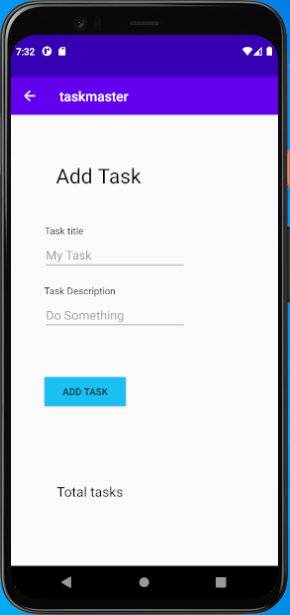
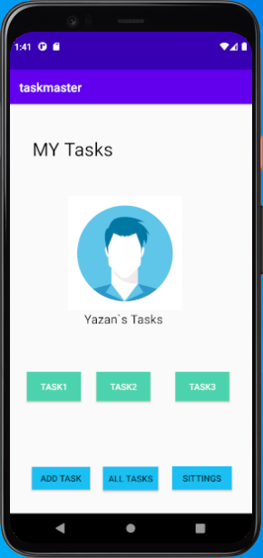
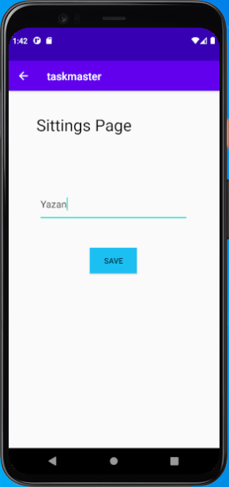
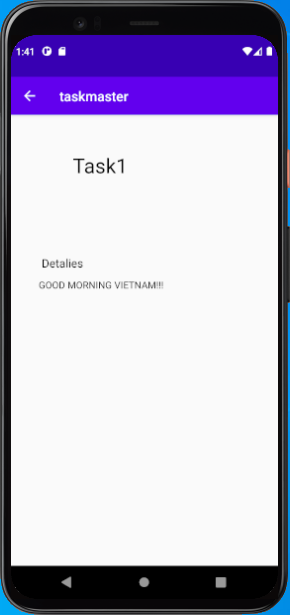
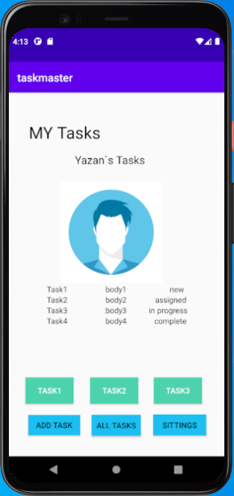
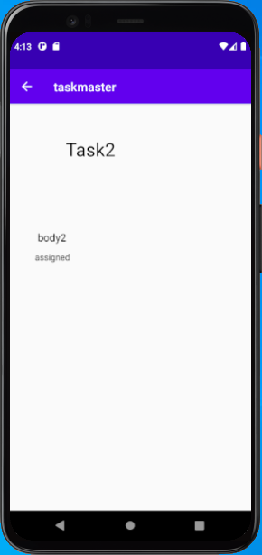

# TaskMaster

## Beginning TaskMaster

**Create Home activity for TaskManger with two buttons Add Tasks will take yuo to AddTasks activity and All Tasks button to AllTasks activity** 
**and in each parent activity we have back arrow to the parent** 
 
 
 

## Adding Data to TaskMaster

**Create Sitting Details page to add the User Name and save it** 
**when you save the User Name it will appear in the home page** 
**Create Task Details page to show every task you chose from the home page** 
**in the task details the name of the task will appear in the top of the page** 
 
 
 

## RecyclerView

**create RecyclerView for the task class that we build and show the data of it in the main page** 
**when you click on any task it will take you to task detail page and show the task info on that page** 
 
 
