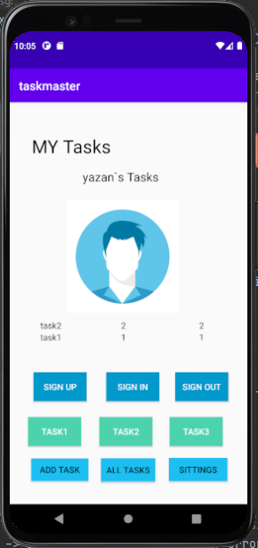
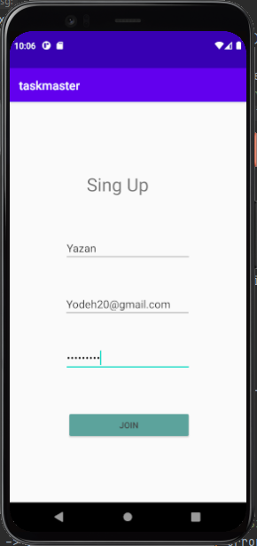
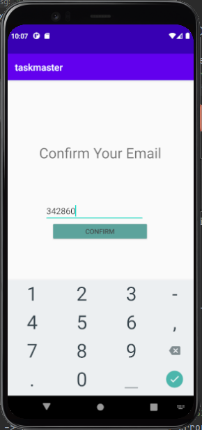
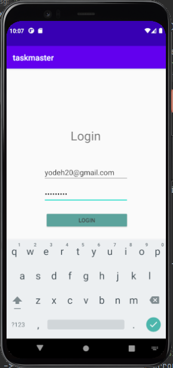
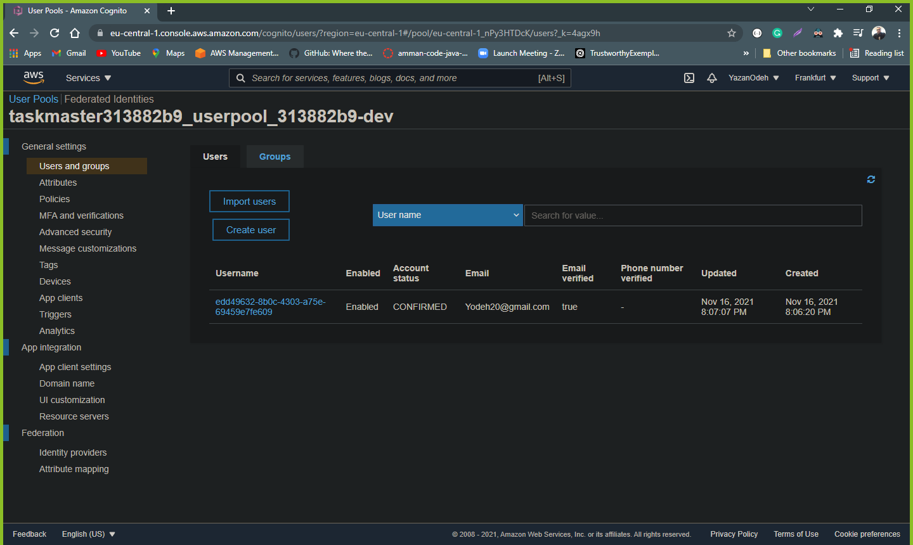

# TaskMaster

## Cognito
**Add Cognito to your Amplify setup. Add in user login and sign up flows to your application, using Cognito’s pre-built UI as appropriate. Display the logged in user’s username somewhere relevant in your app.** 

